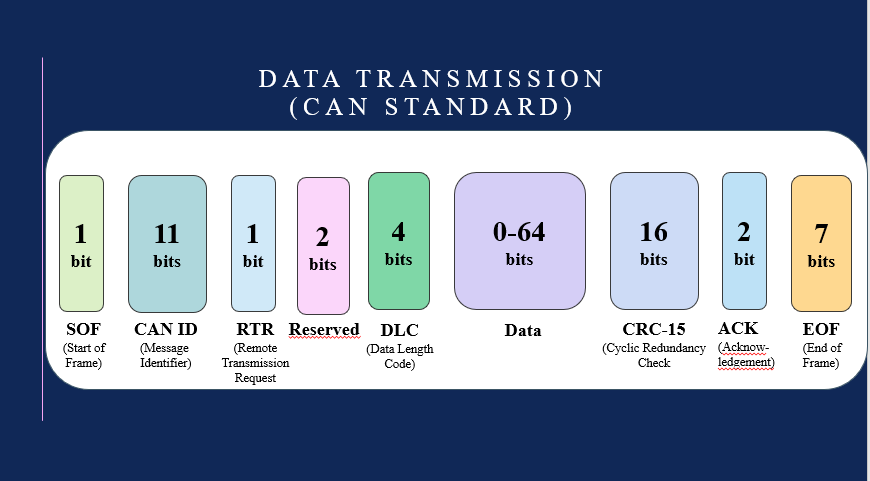
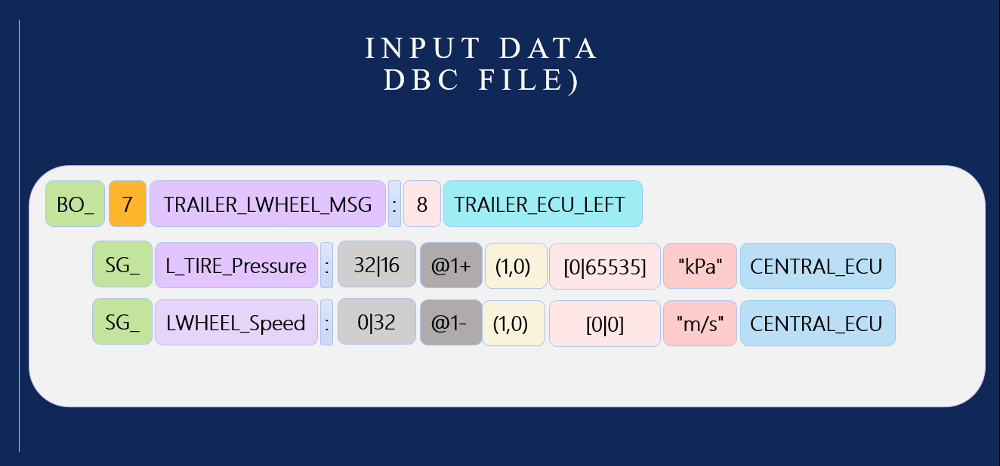
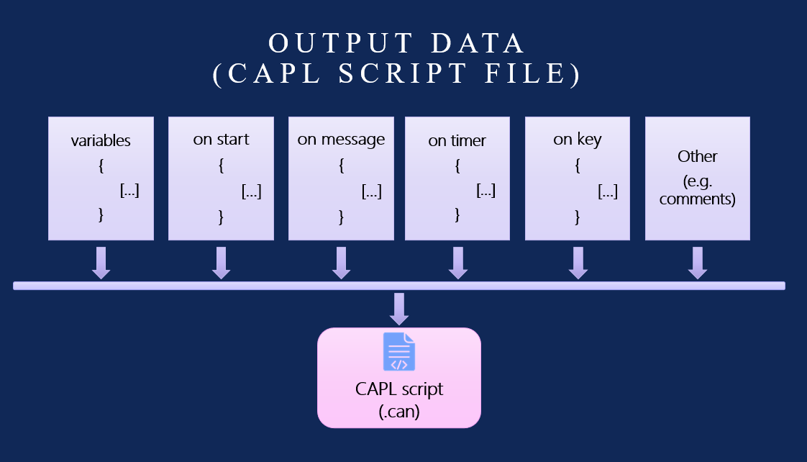
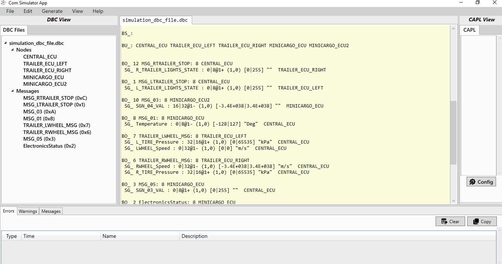
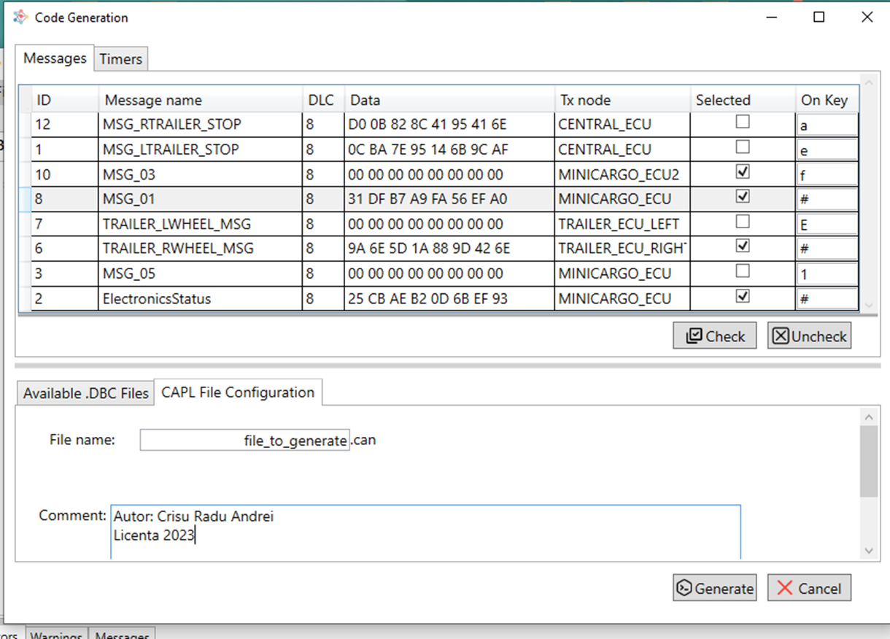
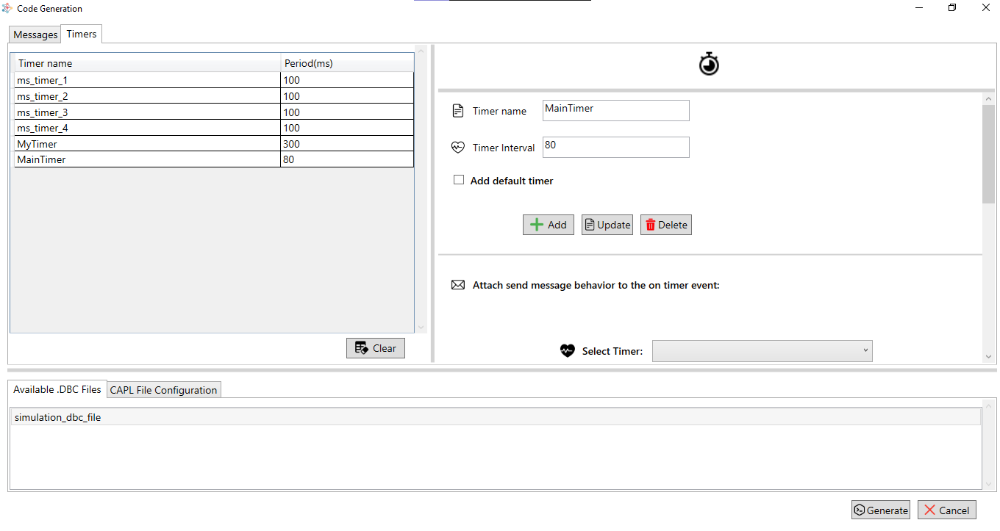
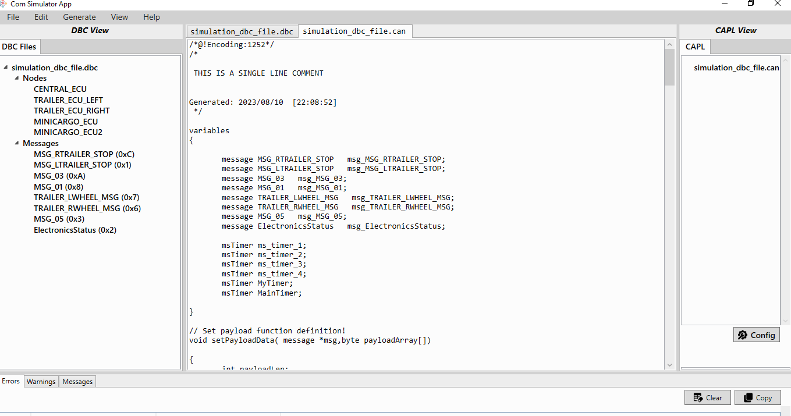
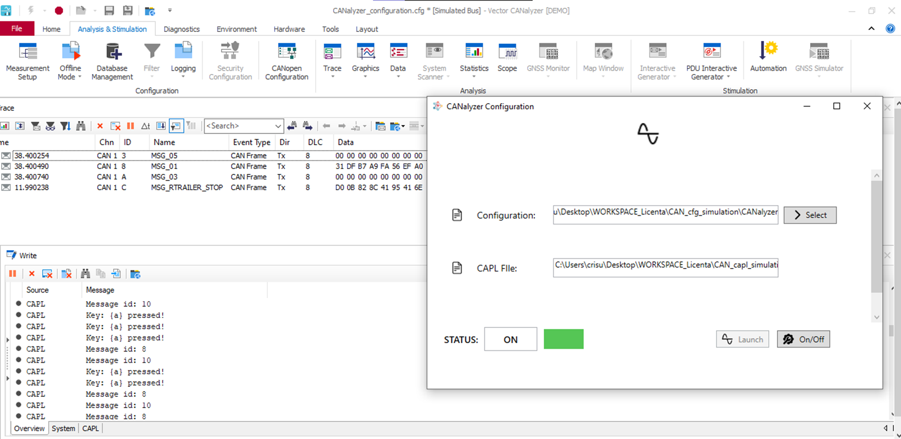

# Communication Simulator
* Designed to parse basic .dbc files and to generate .can (CAPL script files).
* Code is generated based on some specified rules that can be edited from UI.
  

## The CAN FRAME

 

## INPUT DATA

 

## OUTPUT DATA

 

## THE RAW DATA

 

## CONFIGURATION

 

  

# THE OUTPUT DATA (generated code)

  

# VALIDATION OF THE GENERATED CODE (CANalyzer simulation)

